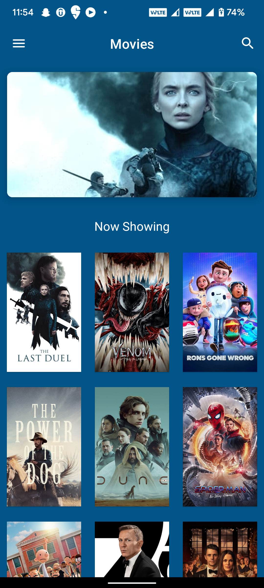
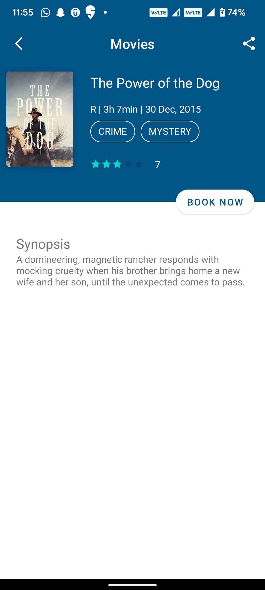

<h1 align="center">Movie Show Case</h1>

Movie Show Case is a sample Android project using <a href="https://www.themoviedb.org/">The Movie DB</a> API based on MVVM architecture. It showcases the latest Android tech stacks with well-designed architecture and best practices.

## Features
* 100% Kotlin
* MVVM architecture
* Reactive pattern
* Android architecture components and Jetpack libraries
* Single activity pattern
* Dependency injection
